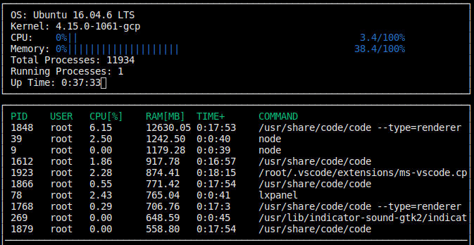
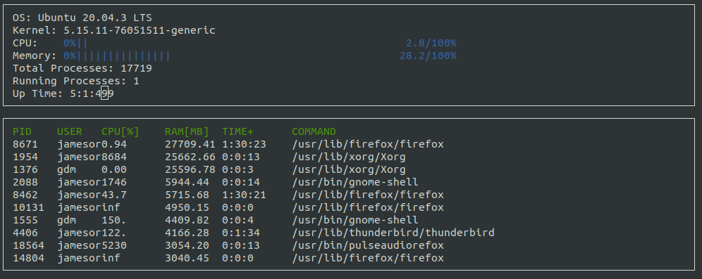

# System Monitor

## Description
This is a diminutive version of a system monitor program that is akin to `htop`, or the older linux command `top`. For more information about htop, click [here](https://en.wikipedia.org/wiki/Htop). The main purpose of this project was to capitalize on creating multiple classes and header files that parse, maniplate, and then display linux system information that can mostly be found in the `/proc` directory on the linux distributions. The program was completed useing C++17, Ubuntu Linux 16 LTS, with ncourses providing the boilerplate for the display/interface, as well as GNU Make and CMake to organize compilation of files.

## ncurses
[ncurses](https://www.gnu.org/software/ncurses/) is a library that facilitates text-based graphical output in the terminal. This project relies on ncurses for display output.

Install ncurses within your own Linux environment: `sudo apt install libncurses5-dev libncursesw5-dev`

## Make & CMake
This project uses [Make](https://www.gnu.org/software/make/) and [CMake](https://cmake.org). 
The Makefile has four targets:
* `build` compiles the source code and generates an executable
* `format` applies [ClangFormat](https://clang.llvm.org/docs/ClangFormat.html) to style the source code
* `debug` compiles the source code and generates an executable, including debugging symbols
* `clean` deletes the `build/` directory, including all of the build artifacts

## Instructions for building boilerplate version

1. Clone the project repository: `git clone https://github.com/udacity/CppND-System-Monitor-Project-Updated.git`

2. Build the project: `make build`

3. Run the resulting executable: `./build/monitor`

4. Finally, implement the `System`, `Process`, and `Processor` classes, as well as functions within the `LinuxParser` namespace.

## Instructions for compiling the completed program from source

1. Make sure ncurses is installed on your Linux machine: `sudo apt install libncurses5-dev libncursesw5-dev`

2. Install [GNU Make](https://www.gnu.org/software/make/) and [CMake](https://cmake.org)

3. Git clone this repository: `git clone https://github.com/James1515/SystemMonitor.git`

4. Build the project: `make build`

5. Run the program with `./build/monitor` or from the build directory `./monitor`

You should then see a program result as the one below:

## Stability Update for Ubuntu 20.04

Under Ubuntu Fossa 20.04 LTS, the system monitor still functions normally. Only anomaly is the RAM column.

